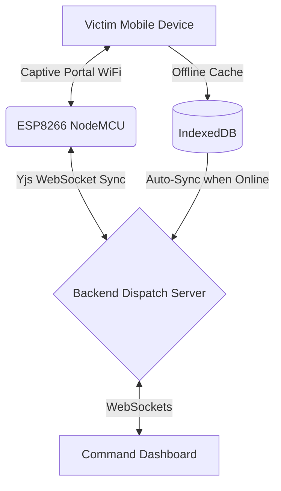

<div align="center">
  
  
  
  
  <br />
  <br />

  <h1>🛡️ RESCUE-MESH</h1>
  <p><b>A Modular Decentralized Response Framework designed to ensure life-critical aid reaches victims even during "Information Blackouts" when cellular networks collapse.</b></p>
  
  <a href="#-quick-start">Quick Start</a> •
  <a href="#-architecture">Architecture</a> •
  <a href="#-features">Features</a> •
  <a href="#-team-contributions">Team</a>
</div>

---

## ⚡ Why RESCUE-MESH?

When natural disasters strike, standard cellular networks are often the first infrastructure to fail. RESCUE-MESH solves this by providing a hyper-local, offline-first mesh network powered by ESP8266 nodes and Conflict-free Replicated Data Types (CRDTs). 

If you can connect to our local WiFi bubble, you can summon an ambulance.

---

## ✨ Features

<details open>
<summary><b>1. Ground-Zero SOS Form (Offline-First)</b></summary>
Victims can submit SOS signals even without an internet connection. Data is cached locally using IndexedDB and automatically syncs (via Yjs CRDTs) the moment an uplink is established.
</details>

<details open>
<summary><b>2. Autonomous Priority Triage AI</b></summary>
An onboard NLP engine automatically scans emergency text, calculating a 0-100 severity score and assigning priority labels (`CRITICAL`, `HIGH`, `MEDIUM`, `LOW`) so dispatchers know who needs help first.
</details>

<details open>
<summary><b>3. Command Dispatch Dashboard</b></summary>
A clean, professional, NDRF-grade dispatch center UI. Dispatchers can view a live geospatial map of requests, monitor fleet statistics, and assign units (Ambulances, Fire Teams) with a single click.
</details>

---

## 🏗️ Architecture



---

## 🚀 Quick Start

Ensure you have Node.js and NPM installed.

### 1. Start the Backend API & Sync Server (Port 4000)
```bash
cd backend
npm install
npm run dev
```

### 2. Start the Frontend Dispatch Center (Port 3000)
```bash
cd frontend
npm install
npm run dev
```

Visit **[http://localhost:3000](http://localhost:3000)** to view the application!

---

## 👥 Team Contributions

| Member | Role | Deliverables |
| :--- | :--- | :--- |
| **Benadic** | **Lead & UI/UX** | Built the responsive Ground-Zero UI, Command Dashboard, Map View, and Offline-first caching logic using Next.js. |
| **Member 2** | **AI Engine** | Designed the NLP Keyword Classifier (`calculate_priority`) to automatically score and triage emergencies. |
| **Member 3** | **Backend/DB** | Built the core Express API logic, WebSocket infrastructure, and the resource dispatch ledger. |

---

<br />

> ### 💬 A Message to the Team from Benadic
> 
> *Hey team, we pulled it off! We went from a simple concept to a fully functioning, offline-capable, responsive dispatch platform. The AI triage is working flawlessly, the backend sync is solid, and the UI is looking like a professional military-grade dashboard. Get some rest tonight, because tomorrow we are going to absolutely crush this hackathon presentation. So proud of what we built together! Let's go win this! 🚀*
